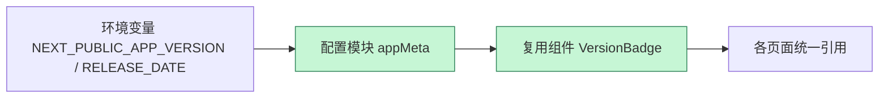

# 1. 问题

多个页面直接硬编码产品版本号与日期（如导航栏显示 "v2026.01.25"），缺乏统一来源与渲染方式，更新时需要逐页人工修改，容易产生不一致，也不利于灰度发布与自动化测试。

## 1.1. **跨页面硬编码的版本号/日期**
- 涉及文件与位置：
  - `src/app/page.tsx` 第 42 行：`v2026.01.25`
  - `src/app/scenarios/[id]/page.tsx` 第 61 行：`v2026.01.25`
  - `src/app/login/page.tsx` 第 27 行：`v2026.01.25`
  - `src/app/login/page.tsx` 第 102 行：`@ 2026.01.25`
  - `src/app/scenarios/page.tsx` 第 84 行：`Current Date: Jan 25, 2026`
- 问题点：信息被写死在视图层，版本与日期的来源不可控，更新需逐页修改，极易遗漏并造成显示不一致。

```tsx
// 例：src/app/page.tsx（问题示例）
<nav>
  {/* ... */}
  <span className="text-sm">v2026.01.25</span>
</nav>
```

## 1.2. **缺乏统一渲染组件与格式约束**
- 相同含义的标签在不同页面以不同文案/格式出现（如 "v2026.01.25"、"@ 2026.01.25"、"Current Date: Jan 25, 2026"），不利于品牌一致性与测试用例复用。

## 1.3. **无法支持灰度与自动化验证**
- 硬编码阻断了在 CI/CD 注入构建元信息（版本号、发布时间、构建哈希）的能力。
- 自动化测试难以基于统一的选择器或数据来源校验版本显示。

# 2. 收益

引入统一来源（配置模块 + 环境变量）与复用组件后，修改一次即可全站生效，显著降低维护成本并提升一致性与可测试性。

## 2.1. **降低维护点数量**
- 将多个页面的分散修改点收敛为单一配置与组件，修改点从 **5** 处下降为 **1** 处。

## 2.2. **提升一致性与品牌统一**
- 统一格式与渲染组件，避免文案/日期格式随页面差异而不一致。

## 2.3. **增强可测试性与可观测性**
- 测试只需校验统一组件的输出或配置来源；同时可注入构建哈希用于定位版本。

## 2.4. **支持灰度/自动化发布流程**
- 通过环境变量在不同环境注入不同版本/日期，便于灰度发布与自动化验证。

# 3. 方案

总体思路：集中版本元信息到单一配置模块，使用 `NEXT_PUBLIC_*` 环境变量在构建期注入，提取 `VersionBadge` 组件统一渲染格式，并替换所有硬编码。

## **3.1. 项目结构变化示意**


该图展示当前结构：每个页面直接在视图中写死版本/日期。



目标结构：通过环境变量 -> 配置模块 -> 复用组件的链路统一输出版本/日期。绿色标注为新增/改造部分。

## 3.2. **引入配置模块与环境变量：解决“跨页面硬编码的版本号/日期”与“无法支持灰度与自动化验证”**

1. 新增配置模块 `src/config/appMeta.ts`：
```ts
// src/config/appMeta.ts
export const APP_VERSION = process.env.NEXT_PUBLIC_APP_VERSION
  ?? process.env.npm_package_version
  ?? '0.0.0';

// 统一使用 YYYY-MM-DD，便于机器可读与排序
export const RELEASE_DATE = process.env.NEXT_PUBLIC_RELEASE_DATE
  ?? new Date().toISOString().slice(0, 10);

export const BUILD_HASH = process.env.NEXT_PUBLIC_BUILD_HASH ?? '';

export const buildLabel = `v${APP_VERSION}`;
export const buildFullLabel = `${buildLabel} @ ${RELEASE_DATE}${BUILD_HASH ? ' #' + BUILD_HASH.slice(0,7) : ''}`;
```

2. 在 CI/CD（如 GitHub Actions）或本地 `.env` 注入：
```dotenv
NEXT_PUBLIC_APP_VERSION=2026.01.26
NEXT_PUBLIC_RELEASE_DATE=2026-01-26
NEXT_PUBLIC_BUILD_HASH=abc123def
```

3. 替换页面中的硬编码为配置导出：
```tsx
// 旧：
<span className="text-sm">v2026.01.25</span>

// 新：
import { buildLabel } from '@/config/appMeta';
<span className="text-sm">{buildLabel}</span>
```

## 3.3. **提取复用组件 VersionBadge：解决“缺乏统一渲染组件与格式约束”**

1. 新增组件 `src/components/VersionBadge.tsx`：
```tsx
// src/components/VersionBadge.tsx
"use client";
import React from 'react';
import { buildFullLabel } from '@/config/appMeta';

/**
 * 统一展示版本与日期；可加 data-testid 便于自动化测试。
 */
export function VersionBadge({ className = '' }: { className?: string }) {
  return (
    <span className={`text-sm font-medium text-slate-500 ${className}`} data-testid="version-badge">
      {buildFullLabel}
    </span>
  );
}
```

2. 页面替换示例（以 `src/app/page.tsx` 为例）：
```tsx
// 旧：
<span className="text-sm font-medium text-slate-500">v2026.01.25</span>

// 新：
import { VersionBadge } from '@/components/VersionBadge';
<VersionBadge className="hover:text-indigo-600 cursor-pointer transition-colors" />
```

3. 将其他页面（`login`、`scenarios`、`scenarios/[id]` 等）同样替换为 `VersionBadge` 或按需使用 `RELEASE_DATE`：
```tsx
// 统一替换“Current Date: Jan 25, 2026”
import { RELEASE_DATE } from '@/config/appMeta';
<div className="text-xs text-slate-400">Current Date: {new Date(RELEASE_DATE).toLocaleDateString('en-US', { month: 'short', day: 'numeric', year: 'numeric' })}</div>
```

## 3.4. **测试与可观测性增强**
- 在组件上添加 `data-testid="version-badge"`，E2E/集成测试可直接断言其文本与格式。
- 暴露 `BUILD_HASH` 片段，便于定位构建版本与问题回溯。

# 4. 回归范围

本次改动涉及所有展示版本/日期的页面。从业务链路视角，应关注登录、进入场景列表、查看场景详情、首页导航等路径上版本与日期的显示一致性与正确性。

## 4.1. 主链路
- 用例 1：未登录用户访问首页
  - 前置条件：`.env` 注入版本与日期
  - 操作：打开首页 -> 检查导航右上角版本标签
  - 期望：显示 `v<版本号> @ <YYYY-MM-DD> #<hash7>`（若注入了 BUILD_HASH）；格式统一
- 用例 2：登录页版本显示
  - 操作：访问 `/login`
  - 期望：页面中的版本/日期统一由组件或配置输出，无硬编码残留
- 用例 3：场景列表页尾部日期与版本
  - 操作：访问 `/scenarios`
  - 期望：日期按统一格式渲染，且来源于 `RELEASE_DATE`
- 用例 4：场景详情页版本显示
  - 操作：访问 `/scenarios/[id]`
  - 期望：版本标签与其他页面一致

## 4.2. 边界情况
- 环境变量缺失：
  - 触发条件：未设置 `NEXT_PUBLIC_APP_VERSION` 或 `NEXT_PUBLIC_RELEASE_DATE`
  - 期望行为：版本回退到 `npm_package_version` 或 `0.0.0`；日期回退到当前日期 ISO（YYYY-MM-DD）
- 不同环境灰度：
  - 触发条件：预发与生产注入不同版本/日期
  - 期望行为：各环境显示各自注入的值；E2E 测试可通过选择器准确断言
- 构建哈希为空：
  - 触发条件：未注入 `NEXT_PUBLIC_BUILD_HASH`
  - 期望行为：不展示哈希片段，其他信息正常显示
